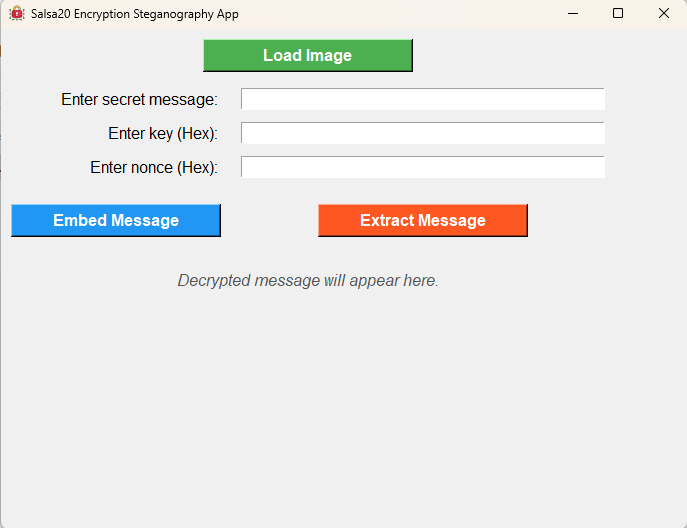

# **Steganography App with Salsa20 Encryption**

  
*Securely hide messages inside images.*

---

## **Overview**

This Steganography App allows you to hide secret messages inside PNG images using **Salsa20 encryption** for added security. The app ensures your messages are safe, even if the embedded image is intercepted.

With an intuitive GUI, you can:  
- **Embed** secret messages into images.  
- **Extract** encrypted messages from stego images.  
- **Decrypt** and display the hidden message.  

Perfect for anyone wanting to learn about cryptography, image processing, or build secure communication systems!

---

## **Features**

- **Streamlined GUI**:  
  The user-friendly interface makes embedding and extracting messages simple and accessible.

- **Salsa20 Encryption**:  
  Messages are encrypted with a **256-bit key** and a unique **nonce**, ensuring confidentiality.

- **PNG Validation**:  
  Only PNG images are allowed, ensuring compatibility and integrity during the embedding process.

- **Secure Key and Nonce**:  
  A randomly generated key and nonce are saved to a text file for secure sharing.

---

## **How It Works**

1. **Message Embedding**:  
   - Load a PNG image.  
   - Enter a secret message.  
   - A random **key** and **nonce** are generated and saved to a `key_nonce.txt` file.  
   - The encrypted message is embedded into the image and saved as a new PNG file.

2. **Message Extraction**:  
   - Load the stego image.  
   - Input the **key** and **nonce** (from the `key_nonce.txt` file).  
   - The app decrypts and displays the hidden message.

---

## **How to Use**

### **1. Embedding a Message**
1. Open the app.  
2. Click **Load Image** and select a PNG file.  
3. Enter your secret message in the provided text field.  
4. Click **Embed Message**.  
5. Save the stego image and securely store the `key_nonce.txt` file.

### **2. Extracting a Message**
1. Open the app.  
2. Click **Load Image** and select the stego PNG file.  
3. Enter the **key** and **nonce** (from `key_nonce.txt`).  
4. Click **Extract Message**.  
5. The hidden message will be displayed.

---

## **Technical Details**

- **Salsa20 Encryption**:  
  - A stream cipher that uses a 256-bit key and a 64-bit nonce.  
  - Ensures fast and secure encryption of your messages.

- **Image Processing**:  
  - Utilizes Python’s `OpenCV` library to embed and extract bits from PNG images.

- **GUI Development**:  
  - Built with Python’s `Tkinter` library for cross-platform compatibility.

---

## **Installation**
I am working on a way to publish the executable file (it's too large for Github). 

1. Clone the repository: https://github.com/AlexToghe/EncryptionStegonagraphy-App.git

2. Create an Anaconda Environment with the environment.yml file in the repository:
    conda env create -f environment.yml

3. run python steg.py

4. Message me to share the exectuable: alextoghe@outlook.com
